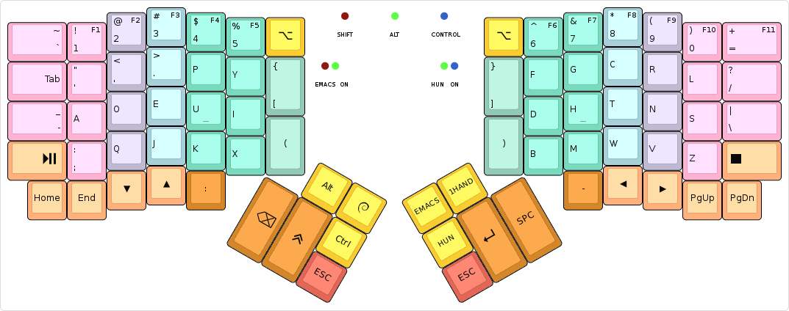
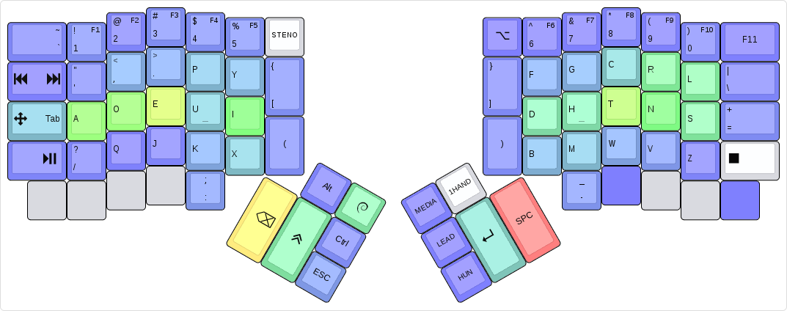

<!-- -*- mode: markdown; fill-column: 8192 -*- -->

ALure
=======================

ALure is based on algernon's Ergodox Layout (V1.11). Changed features include basing keys off of Programmers Dvorak (as compared to normal Dvorak), and adoption to the Ergodox Infinity, along with tweaks to improve compatibility with NeoVim and AwesomeWM. Removed/hidden features include the Steno, ADORE and Hungarian layers.

Do note: Many changes are work in progress, so documentation and code may not be in sync.

This is an unconventional layout for the [ErgoDox Infinity][Infinity]. For more details about the history of algernon's layout, see his [blog posts about my ErgoDox journey][blog-ergodox].

 [Infinity]: https://input.club/devices/infinity-ergodox/
 [blog-ergodox]: https://asylum.madhouse-project.org/blog/tags/ergodox/


## Table of Contents

* [Layer](#layers)
    - [Base layer](#base-layer)
* [Tools](#tools)
    - [Heatmap](#heatmap)
    - [Layer notification](#layer-notification)
* [Special features](#special-features)
    - [Unicode Symbol Input](#unicode-symbol-input)
* [Building](#building)
    - [Using on Windows](#using-on-windows)
* [Changelog](https://github.com/aersyl/ALure/blob/master/NEWS.md#readme)
* [License](#license)

# layers

## Base layer

[](http://www.keyboard-layout-editor.com/#/gists/28f7eb305fdbff943613e1dc7aa9e82b)

At its core, this is a Dvorak layout, with some minor changes. The more interesting parts are how certain keys behave:

* The number row is the same as in programmer's Dvorak. The function keys are on the **Media** layer.
* The `Shift`, `Alt`, and `Control` modifiers are one-shot. When tapped, they are considered active for the next key press only. When double tapped, they toggle on, until a third, single tap sometime later. When held, they act as expected. My usual pattern is that I use these for the next keypress only, so this behaviour is perfect. If I need them held, I'll just double-tap.
* The `GUI` key is special, because when I double-tap it, it sends `GUI + w`, which pops up an application selector. It also switches to a one-shot layer, where the number row on the left half turns into app selector macros, for the most common things I usually want to switch to. Otherwise it behaves as on a normal layout.
* The `ESC` key also doubles as a one-shot cancel key: if tapped while any of the one-shot modifiers are in-flight (as in, single-tapped, and not expired yet), it cancels all one-shot modifiers. It also cancels the **Hun** layer, if active. Otherwise it sends the usual keycode.
* The **Media** key is one shot..
* The **Fx** key is one-shot, and activates the **Media** layer, along with a one-shot `Alt`.
* When holding the `Tab`/**Arrow** key, the arrow layer activates while the key is held. Tapping the key produces the normal, `Tab` key. Double-tapping it toggles the **Arrow** layer on until a third tap.
* Tapping the `:` key once yields `:`, tapping it twice yields `;`.
* Tapping the `[{(`/`)}]` keys once yields `[` (or `{` when shifted), tapping them twice yields `(`.
* The **Lead** key allows me to type in a sequence of keys, and trigger some actions:
    - `LEAD l` uses the unicode input method to enter a `λ`.
    - `LEAD s` does a lot of magic to type in a shruggie: `¯\_(ツ)_/¯`
    - `LEAD y` types `\o/`.
    - `LEAD w m` maximises the currently focused window.
    - `LEAD v` prints the firmware version, the keyboard and the keymap.
    - `LEAD d` toggles logging keypress positions to the HID console.
    - `LEAD t` toggles time travel. Figuring out the current `date` is left as an exercise to the reader.
    - `LEAD u` enters the [Unicode symbol input](#unicode-symbol-input) mode.
    
The symbols on the front in the image above have the same color as the key that activates them, with the exception of the **Arrow** layer, which is just black on the front.

# Special features

## Unicode Symbol Input

Once in the Unicode Symbol Input mode, one is able to type in symbol names, press `Enter` or `Space`, and get the Unicode symbol itself back. When in the mode, a capital `U` is printed first. Once the sequence is finished, all of it is erased by sending enough `Backspace` taps, and the firmware starts the OS-specific unicode input sequence. Then, it looks up the symbol name, and enters the associated code. If it is not found, it will just replay the pressed keycodes.

For the list of supported symbols, please see the source.

This is an experimental feature, and may or may not work reliably.

# Tools

## Heatmap

When the keypress logging functionality is enabled (by `LEAD d`), the keyboard will output a line every time a key is pressed, containing the position of the key in the matrix. This allows one to collect this information, and build analytics over it, such as a heat map, including dead keys too.

Included with the firmware is a small tool that can parse these logs, and create a heatmap that one can import into [KLE][kle]. To use it, either pipe the output of `hid_listen` into it, or pipe it an already saved log, and it will save the results into files in an output directory (given on the command-line). See the output of `tools/log-to-heatmap.py --help` for more information.

 [kle]: http://www.keyboard-layout-editor.com/

The generated heatmap looks somewhat like this:

 

## Layer notification

There is a very small tool in `tools/layer-notify`, that listens to the HID console, looking for layer change events, and pops up a notification for every detected change. It is a very simple tool, mainly serving as an example.

# Building

To make my workflow easier, this layout is maintained in [its own repository][aerysl:ALure]. To build it, you will need the [QMK][qmk] firmware checked out, and this repo either checked out to something like `keyboards/ergodox_ez/algernon-master`. One way to achieve that is this:

 [aerysl:ALure]: https://github.com/aerysl/ALure
 [qmk]: https://github.com/jackhumbert/qmk_firmware

```
$ git clone https://github.com/jackhumbert/qmk_firmware.git
$ cd qmk_firmware
$ git clone https://github.com/aerysl/ALure.git \
            keyboards/ergodox/keymaps/ALure-master
$ make keyboard=ergodox keymap=ALure-master
```

From time to time, updates may be submitted back to the QMK repository. If you are reading it there, you can build the firmware like any other firmware included with it (assuming you are in the root directory of the firmware):

```
$ make keyboard=ergodox keymap=ALure
```

## Using on Windows

The keymap default to forcing NKRO, which seems to upset Windows, and except the modifiers, none of them work. If you experience this problem, recompile the firmware with `FORCE_NKRO=no` added to the `make` command line.

# License

The layout, being a derivative of the original TMK firmware which is under the GPL-2+, this layout is under the GPL as well, but GPL-3+, rather than the older version.
